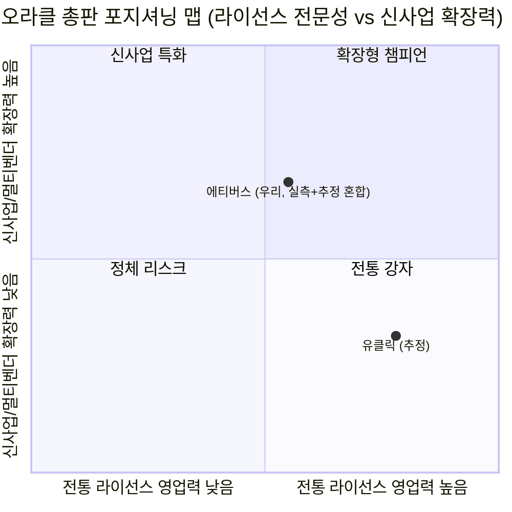
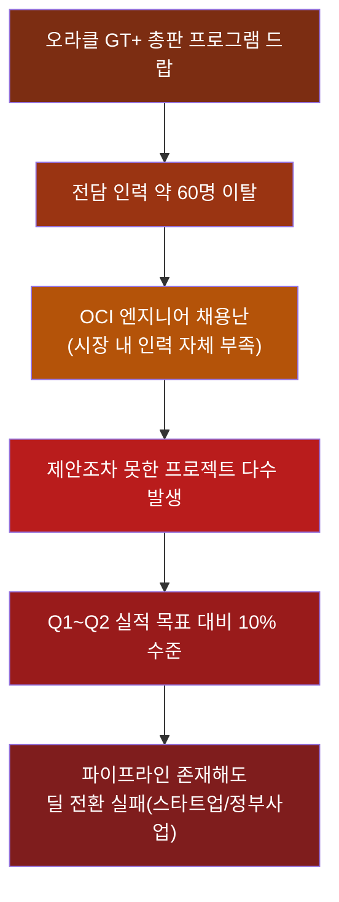
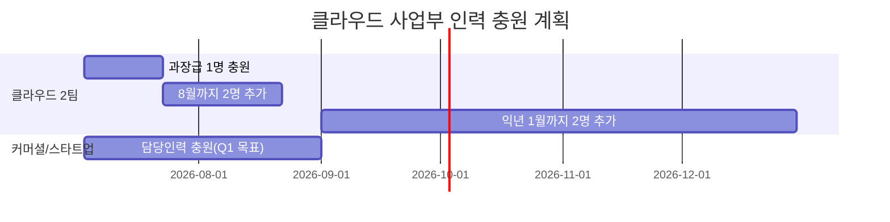
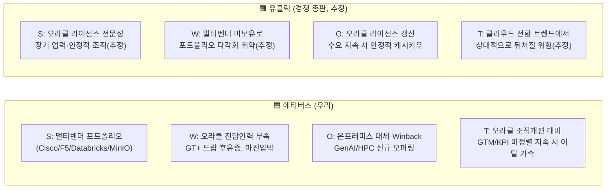
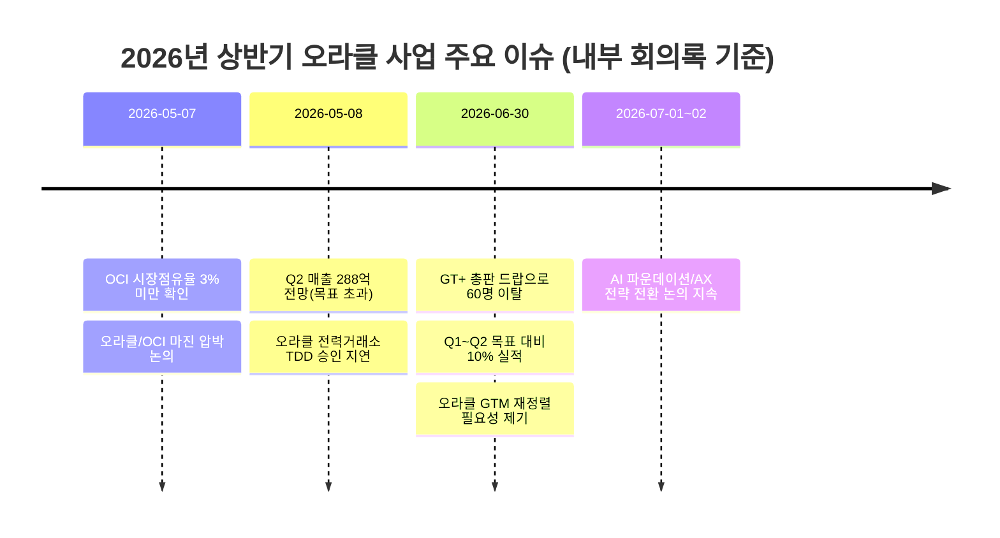

# 🏆 오라클 총판 영업력 비교분석
## 에티버스(우리) vs 유클릭(경쟁 총판)

> [!info] 📋 보고서 개요
> - **목적**: 오라클 국내 총판 생태계에서 경쟁 총판 **유클릭**과 **에티버스**의 영업력을 다각도로 비교하고, 강화 포인트를 도출한다.
> - **데이터 출처**: 사내 주간/월간 회의록(Plaud 녹음 기록, 2026-05~07) 및 공개적으로 알려진 유클릭의 사업 포지셔닝.
> - **⚠️ 데이터 신뢰도 유의사항**: 우리 측 수치는 실제 내부 회의록에서 확인된 값(🟢)이며, 유클릭 관련 항목은 업계에 알려진 일반적 인식에 근거한 **추정치(🟡)**입니다. 실제 의사결정에 활용하려면 유클릭 관련 항목은 시장 조사·파트너 채널을 통해 별도 검증이 필요합니다.

---

## 1. 한눈에 보는 핵심 결론

> [!warning] 🎯 Executive Summary
> 1. **라이선스 중심 전통 영업에서는 유클릭이 앞선다는 것이 업계 통념**이다 — 유클릭은 오라클 DB 라이선스/ULA 갱신 중심의 오래된 전문 총판으로 알려져 있다.
> 2. **에티버스는 멀티벤더 포트폴리오(Cisco·F5·Databricks·MinIO·Elastic 등)가 강점**이나, 오라클 단일 사업 안에서는 **인력난·마진압박·GTM 미정렬**이라는 3대 구조적 약점을 안고 있다(🟢 회의록 확인).
> 3. **가장 시급한 이슈는 'GT+ 총판 드랍'으로 인한 전담인력 약 60명 이탈**이며, 이로 인해 제안조차 못한 프로젝트가 다수 발생 중(🟢 06-30 회의록).
> 4. OCI 국내 시장점유율은 **3% 미만**(🟢 05-07 회의록)으로, 절대 규모에서 아직 경쟁 총판 대비 열위에 있다.
> 5. 반대로 **신사업(GenAI·HPC·멀티클라우드 Winback)** 축에서는 에티버스가 유클릭보다 다양한 무기를 갖춘 것으로 판단된다(🟡 상대 비교는 추정).

---

## 2. 오라클 총판 생태계 포지셔닝



> [!tip] 해석
> 유클릭은 "전통 강자" 사분면, 에티버스는 "확장형 챔피언" 방향으로 이동 중이나 아직 라이선스 기본기(전통 영업력)에서 완전히 따라잡지 못한 **과도기 포지션**으로 판단됨.

---

## 3. 정량 비교 스코어카드

| 비교 축 | 에티버스(우리) | 유클릭 | 신뢰도 | 근거 |
|---|---|---|---|---|
| 오라클 단일 사업 집중도 | 낮음 (멀티벤더 병행) | 높음 (오라클 특화) | 🟡 | 업계 일반 인식 |
| OCI(클라우드) 시장점유율 | **3% 미만** | 알수없음 | 🟢/🟡 | 05-07 주간회의 |
| 전담 영업/기술 인력 규모 | **GT+ 드랍으로 약 60명 이탈**, 채용난 지속 | 상대적으로 안정적(추정) | 🟢/🟡 | 06-30 오라클 GTM 회의 |
| 마진율(핵심 딜 기준) | ULA/클라우드 딜 마진 **5%→2.5%로 하락** | 알수없음 | 🟢/🟡 | 05-07 회의 |
| Q1~Q2 목표 대비 실적 | **목표 대비 약 10% 수준** (심각한 저조) | 알수없음 | 🟢/🟡 | 06-30 회의 |
| 공공/금융 파이프라인 | 한국은행·광주은행·우체국 등 다수 확보 | 공공기관 라이선스 갱신 강자로 알려짐 | 🟢/🟡 | 05-07~08 회의 |
| 멀티벤더 포트폴리오 | Cisco/F5/Databricks/MinIO/Elastic 등 폭넓음 | 오라클 중심, 포트폴리오 협소 | 🟢/🟡 | 06-04, 06-23 회의 외 |
| 오라클 GTM/KPI 정렬도 | **미정렬 — 재정렬 필요 상태** | 알수없음 | 🟢/🟡 | 06-30 회의 |

### 3-1. 스코어 시각화 (10점 척도, ▮=1점)

```
라이선스 전문성        유클릭   ▮▮▮▮▮▮▮▮▮░ 9  (🟡추정)
                       에티버스 ▮▮▮▮▮▮▮░░░ 7  (🟡추정)

클라우드(OCI) 대응력    유클릭   ▮▮▮▮▮░░░░░ 5  (🟡추정)
                       에티버스 ▮▮▮▮▮▮░░░░ 6  (🟢+🟡 혼합)

인력/조직 안정성        유클릭   ▮▮▮▮▮▮▮░░░ 7  (🟡추정)
                       에티버스 ▮▮▮▮░░░░░░ 4  (🟢 GT+ 드랍 반영)

공공/금융 네트워크      유클릭   ▮▮▮▮▮▮▮▮░░ 8  (🟡추정)
                       에티버스 ▮▮▮▮▮▮▮░░░ 7  (🟢 실측)

멀티벤더 신사업 확장력  유클릭   ▮▮▮▮░░░░░░ 4  (🟡추정)
                       에티버스 ▮▮▮▮▮▮▮▮░░ 8  (🟢 실측)

GTM/벤더 정렬도        유클릭   ▮▮▮▮▮▮░░░░ 6  (🟡추정)
                       에티버스 ▮▮▮▮▮░░░░░ 5  (🟢 실측, 정렬 미흡 자인)
```

---

## 4. 조직 구조 및 인력 이슈 (실측 데이터 기반)



> [!danger] 🚨 가장 심각한 리스크
> 인력 공백이 **영업 기회 손실로 직결**되고 있음. 클라우드 2팀(커머셜/SMB/스타트업 담당)은 팀장 부재 상태이며, 정부지원사업(양자역학·우주 등)에서 유망 리드를 확보하고도 담당 인력 부족으로 계약 전환에 실패한 사례가 반복됨 (06-30 회의록).

### 인력 충원 로드맵 (실측 회의 액션아이템 기반)



---

## 5. SWOT 비교



---

## 6. 실측 기반 – 우리의 오라클 사업 현안 타임라인



---

## 7. 영업력 강화를 위한 전략 제언

| 우선순위 | 액션 | 담당(회의록 기준) | 목표 시점 |
|---|---|---|---|
| 🔴 최우선 | 클라우드 2팀 인력 충원(과장급 1명→8월 2명→익년1월 2명, 총 6명) | 클라우드사업부 | 2027-01 |
| 🔴 최우선 | OPN 넘어 AWS/Azure 등 타 클라우드 경험자·외부 파트너 출신 채용 확대 | 인사/사업부장 | 지속 |
| 🟠 상 | 오라클 조직개편(라이선스·클라우드·HW 통합)에 맞춘 GTM/조직/KPI 재정렬 로드맵 수립 | 전략기획팀 | TBD |
| 🟠 상 | 스타트업/ISV 공동영업 전담 인력 배치로 파이프라인 유실 방지 | 각 사업본부장 | TBD |
| 🟡 중 | OCI 보안관제 협력사 확대(안랩·SK쉴더스 등, 현재 윈스테크 1곳 편중) | 보안 사업부 | TBD |
| 🟡 중 | 멀티벤더 강점(Cisco/F5/Databricks/MinIO) 기반 코셀(Co-sell) 체계 제도화 | 김경환 상무 외 | 4단계 로드맵 진행 중 |
| 🟢 중장기 | 계약서 표준화(미납시 서비스 자동중단 조항) 및 크레딧 정책 개선 요청 | 법무/전략기획 | TBD |

> [!success] ✅ 우리의 차별화 포인트
> 유클릭이 오라클 단일 축에 집중된 "전문 총판"이라면, 에티버스는 **오라클+Cisco+F5+Databricks+MinIO+Elastic**을 아우르는 **멀티벤더 통합 제안력**이 구조적 차별점이다. 코셀 체계가 제도화되면 이 강점이 실제 매출로 전환될 잠재력이 큼(현재 4단계 로드맵 중 2단계 '제도 준비' 단계).

---

## 8. 부록 — 데이터 소스 및 한계

> [!note] 📚 참고한 회의록
> - 05-07 주간 회의: 오라클/OCI 마진 압박, 시장점유율 데이터
> - 05-08 주간 회의: Q2 매출 전망, 오라클 주요 딜 현황
> - 06-30 회의: 오라클 파트너 GTM 재정렬, 인력 확충, 리스크 대응
> - 06-29 주간 사업 현황: 코셀 활성화 로드맵
> - 06-10 주간 회의: 총판 평가 체계(타 벤더 사례 참고)

> [!warning] ⚠️ 분석의 한계
> - 유클릭의 실제 매출·인력·마진 등 정량 데이터는 내부 자료에 존재하지 않아 **업계 일반 인식에 기반한 추정**으로 표기했습니다.
> - 본 보고서를 의사결정에 활용하기 전, 유클릭 관련 항목은 시장조사·채널파트너 인터뷰 등을 통한 **별도 검증**을 권장합니다.

---
#오라클 #총판전략 #경쟁분석 #에티버스 #유클릭
